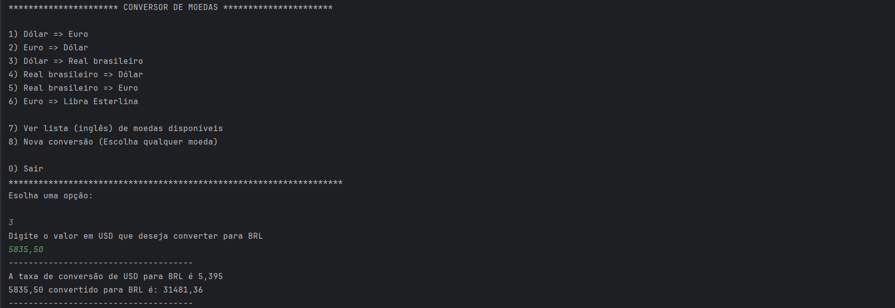
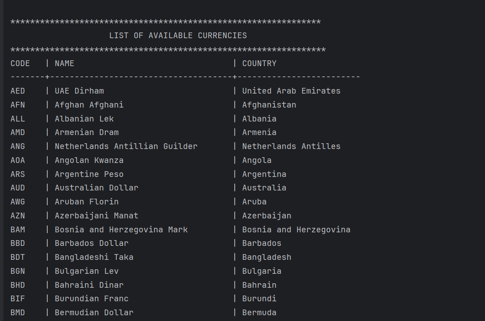

# 💱 Conversor de Moedas - Challenge ONE (Alura + Oracle)

  
  &nbsp;
  
  &nbsp;
  

> Um conversor de moedas iterativo via console, desenvolvido como parte do desafio do programa ONE (Oracle Next Education).

## 🖥️ Preview do Projeto
- **Menu**

- **Lista de Moedas**

## 📺 Demonstração

## 🚀 Funcionalidades
- **Conversão em Tempo Real:** Consumo da [ExchangeRate-API](https://www.exchangerate-api.com/) para obter cotações atualizadas.
- **Menu Interativo:** Interface de console.
- **Listagem Inteligente de Moedas:** Leitura de arquivo local (`currencies.csv`) para exibir uma tabela formatada com código das, nome da moeda e o país.
- **Histórico de Conversão:** Exibição detalhada da taxa e do valor final.
- **Tratamento de Erros:** Uso do `try/catch` para tratamento de erros e exceções.
- **Arquitetura:** Separação de responsabilidades.

## 🛠️ Tecnologias Utilizadas
- **Java 21:** Linguagem principal.
- **Gson (Google):** Para desserialização do JSON da API.
- **java.net.http:** Para realizar as requisições HTTP.
- **Java Records:** Para modelagem imutável dos dados.
- **Scanner & Regex:** Para leitura e validação de dados de entrada.
- **IntelliJ IDEA:** IDE utilizada.

## 📂 Estrutura do Projeto
O projeto foi organizado pensando em desacoplamento e responsabilidade única:

- `Main`: Ponto de entrada (apenas inicia o menu).
- `MainMenu`: Gerencia toda a interação com o usuário e exibição visual.
- `ConsultExchange`: Responsável apenas pela conexão com a API.
- `ConvertData`: "Tradutor" que converte JSON para Objetos Java.
- `CurrencyDictionary`: Lê o arquivo `.csv` e carrega os dados das moedas na memória.
- `CurrencyData` & `ResponseExchange`: Records para transporte de dados

## 🔧 Como Executar
1. Tenha o **Java (JDK 17 ou superior)** instalado.
2. Ter uma chave de API da [ExchangeRate-API](https://www.exchangerate-api.com/).

